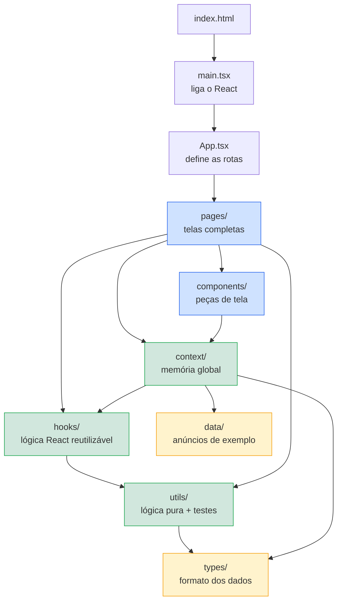
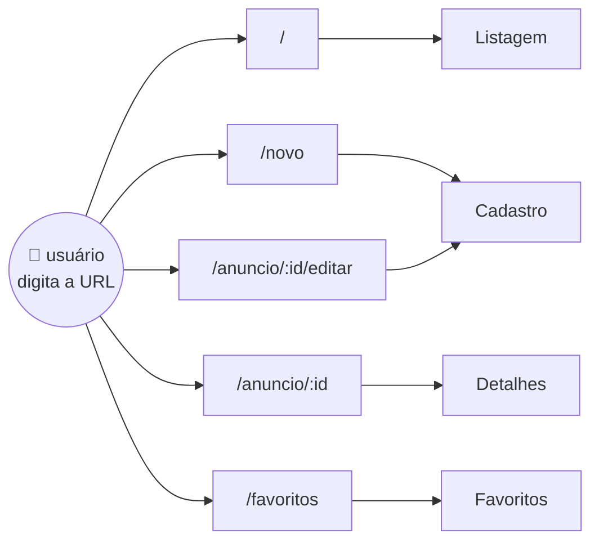
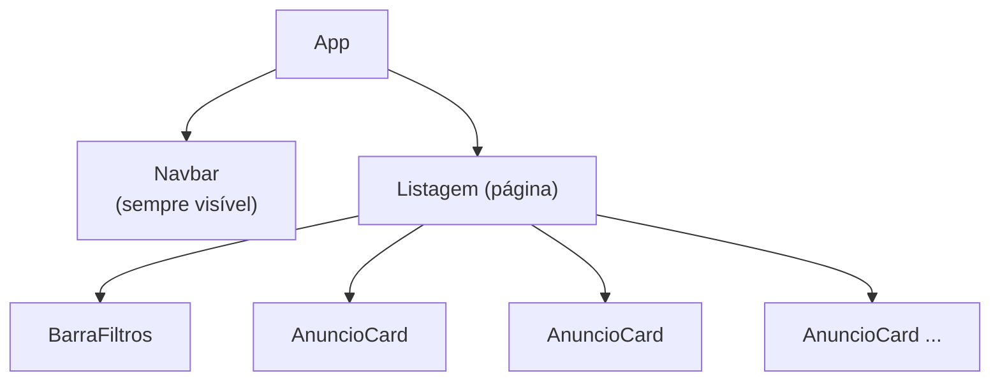
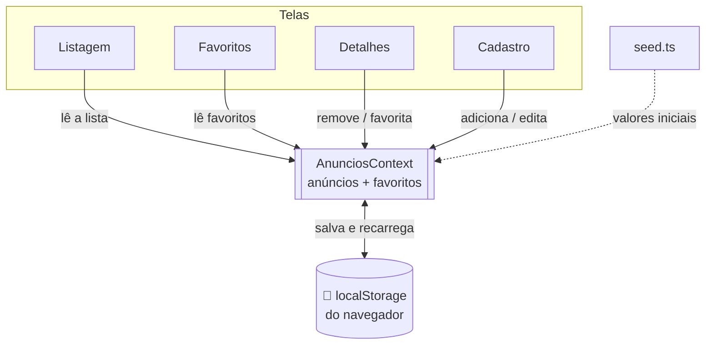
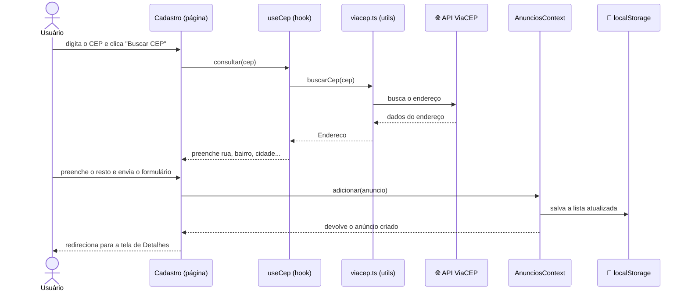

# Guia do Projeto — Site de Anúncios

Este documento explica **como o projeto é organizado** e **para que serve cada
pasta e cada arquivo**. Foi escrito para quem já programa, mas está começando
agora em **React** e **Vite**. Leia de cima para baixo: a ordem segue mais ou
menos o caminho que os dados percorrem na aplicação.

---

## 1. Conceitos rápidos (para acompanhar o resto)

Antes de ver os arquivos, três ideias que se repetem o tempo todo:

- **Vite**: é a ferramenta que *liga* o projeto durante o desenvolvimento
  (`npm run dev`) e que *empacota* tudo para produção (`npm run build`). Pense
  nele como o "motor" que pega nossos arquivos e entrega um site funcionando no
  navegador.

- **React**: é a biblioteca que monta a tela. Em React a gente escreve
  **componentes**: funções que devolvem algo parecido com HTML (chamado JSX).
  Exemplo: `<button>Salvar</button>` dentro de um arquivo `.tsx`.

- **Componente**: uma função que desenha um pedaço da tela. Componentes podem
  usar outros componentes, como peças de Lego. A tela inteira é uma árvore de
  componentes.

- **Estado (state)**: são os dados que mudam enquanto o usuário usa o site (o
  texto digitado, a lista de anúncios...). Quando o estado muda, o React redesenha
  a tela sozinho.

- **Props**: são os "parâmetros" que um componente recebe de quem o usa.
  Ex: `<AnuncioCard anuncio={...} />` — aqui `anuncio` é uma prop.

- **Hook**: uma função especial do React cujo nome começa com `use`
  (ex: `useState`, `useEffect`). Serve para dar "poderes" ao componente, como
  guardar estado ou rodar código em certos momentos.

- **`.ts` vs `.tsx`**: arquivos `.ts` são TypeScript puro (só lógica). Arquivos
  `.tsx` são TypeScript que **também** contêm JSX (telas/componentes).

---

## 2. Visão geral das pastas

```
testeClaude/
├── index.html            ← página inicial (onde o Bootstrap é carregado)
├── package.json          ← lista de dependências e comandos (npm run ...)
├── vite.config.ts        ← configuração do Vite e dos testes
├── tsconfig*.json        ← configuração do TypeScript
│
└── src/                  ← TODO o código da aplicação fica aqui
    ├── main.tsx          ← ponto de partida do app
    ├── App.tsx           ← define as rotas (quais telas existem)
    ├── index.css         ← estilos próprios (quase vazio; usamos Bootstrap)
    │
    ├── types/            ← formatos dos dados (interfaces do TypeScript)
    ├── data/             ← dados de exemplo iniciais
    ├── utils/            ← funções de lógica pura (+ testes)
    ├── hooks/            ← lógica reutilizável de React
    ├── context/          ← "memória global" compartilhada entre as telas
    ├── components/       ← pedaços de tela reutilizáveis
    ├── pages/            ← as telas completas (uma por rota)
    └── test/             ← configuração dos testes
```

A regra mental é: **quanto mais embaixo na lista, mais "perto da tela" o arquivo
está**. `types` é só formato de dado; `pages` é a tela inteira que o usuário vê.

---

### 2.1. Mapa visual das camadas

> **Como ver os diagramas:** eles estão escritos em **Mermaid**. O GitHub os
> desenha automaticamente. No VS Code, instale a extensão *"Markdown Preview
> Mermaid Support"* e abra o preview (ícone de lupa no canto, ou `Ctrl+Shift+V`).

O diagrama abaixo mostra **quem usa quem**. As setas apontam para o que o arquivo
*depende*. Repare que a tela (em cima) depende da lógica (embaixo), nunca o contrário:



🟦 azul = desenha a tela &nbsp;&nbsp; 🟩 verde = lógica/estado &nbsp;&nbsp; 🟨 amarelo = dados

---

### 2.2. Mapa de rotas (qual URL abre qual tela)

Definido em `App.tsx`. O `:id` é a parte variável da URL (o id do anúncio):



> Note que `/novo` e `/anuncio/:id/editar` abrem a **mesma** tela (`Cadastro`):
> ela serve tanto para criar quanto para editar.

---

### 2.3. Árvore de componentes (como a tela é montada)

Toda tela começa pelo `App`, que sempre mostra a `Navbar` no topo + a página da
rota atual. Exemplo com a página `Listagem` aberta:



> Um **componente** (ex: `AnuncioCard`) é reutilizável e aparece várias vezes.
> Uma **página** (ex: `Listagem`) junta vários componentes para formar a tela toda.

---

### 2.4. O Context como "memória" central

O `AnunciosContext` é o ponto onde os dados vivem. Todas as telas leem e escrevem
nele, e ele guarda tudo no navegador via `localStorage`:



---

## 3. Arquivos da raiz (configuração)

Esses arquivos não desenham nada na tela — eles configuram as ferramentas.

| Arquivo | Para que serve |
|---|---|
| `index.html` | A única página HTML do site. Tem uma `<div id="root">` vazia onde o React injeta tudo, e o `<link>` que carrega o **Bootstrap**. |
| `package.json` | Lista as bibliotecas usadas (React, React Router...) e define os comandos `npm run dev`, `npm run build`, `npm test`. |
| `package-lock.json` | Trava as versões exatas das bibliotecas. **Não edite à mão.** |
| `vite.config.ts` | Configura o Vite (ativa o suporte a React) e o ambiente de testes (Vitest). |
| `tsconfig.json` / `tsconfig.node.json` | Regras do TypeScript (o quão rígido ele é ao checar os tipos). |

> **Onde a aplicação "começa"?** O `index.html` chama o `src/main.tsx`. É de lá
> que tudo dispara.

---

## 4. A pasta `src/` — o código de verdade

### 4.1. Arquivos de entrada

#### `src/main.tsx` — o ponto de partida
É o **primeiro** arquivo que roda. Ele faz 3 coisas:
1. Encontra a `<div id="root">` no HTML.
2. "Liga" o React ali dentro.
3. Envolve o app em duas "camadas" importantes:
   - `<BrowserRouter>`: liga o sistema de rotas (trocar de tela sem recarregar a página).
   - `<AnunciosProvider>`: disponibiliza os dados (anúncios e favoritos) para o app inteiro.

#### `src/App.tsx` — o mapa de rotas
Define **quais telas existem e em qual endereço (URL) cada uma aparece**.
Por exemplo: `/` mostra a Listagem, `/novo` mostra o Cadastro, `/anuncio/:id`
mostra os Detalhes. O `:id` é uma parte variável da URL (o id do anúncio).
Também coloca a `Navbar` no topo de todas as telas.

#### `src/index.css` — estilos próprios
Quase vazio de propósito: a aparência vem do **Bootstrap**. Esse arquivo só
guarda pequenos ajustes nossos.

---

### 4.2. `src/types/` — o formato dos dados

**Responsabilidade:** descrever *como são* os nossos dados, sem nenhuma lógica.

- **`index.ts`**: define as **interfaces** do TypeScript:
  - `Anuncio` — como é um anúncio (título, preço, categoria, endereço, data...).
  - `Endereco` — cep, rua, bairro, cidade, estado.
  - `Categoria` — a lista fixa de categorias permitidas.
  - `FiltrosAnuncio` — o formato dos filtros da busca.

  > Pense nas interfaces como "fichas em branco" que dizem quais campos um dado
  > precisa ter. Elas ajudam o editor a avisar quando esquecemos um campo ou
  > escrevemos o nome errado — **antes** de rodar o site.

---

### 4.3. `src/data/` — dados de exemplo

**Responsabilidade:** fornecer conteúdo inicial para o site não abrir vazio.

- **`seed.ts`**: uma lista com 3 anúncios prontos ("seed" = semente). Eles
  aparecem na primeira vez que você abre o site. Depois, o que você criar fica
  salvo no navegador.

---

### 4.4. `src/utils/` — lógica pura (e os testes)

**Responsabilidade:** funções que **só recebem dados e devolvem dados**, sem
mexer na tela. São as mais fáceis de testar.

- **`filtros.ts`**: funções para **filtrar** (por busca, categoria, preço) e
  **ordenar** (por preço ou data) a lista de anúncios.
- **`viacep.ts`**: funções que falam com a **API do ViaCEP** para descobrir o
  endereço a partir do CEP, e que tratam a resposta (inclusive quando o CEP não
  existe).
- **`formato.ts`**: funções pequenas para mostrar valores bonitinhos — preço em
  reais (`R$ 1.200,00`) e data no formato brasileiro.
- **`filtros.test.ts`** e **`viacep.test.ts`**: os **testes automáticos** dessas
  funções. Rode com `npm test`. Arquivos terminados em `.test.ts` não vão para o
  site final — servem só para conferir que a lógica funciona.

> Por que separar essa lógica em `utils`? Porque assim ela fica **isolada da
> tela** e pode ser testada sozinha. É a parte mais "garantida" do projeto.

---

### 4.5. `src/hooks/` — lógica reutilizável de React

**Responsabilidade:** empacotar comportamentos que várias telas podem reaproveitar.
Todo hook começa com `use`.

- **`useLocalStorage.ts`**: funciona como o `useState`, mas também **salva no
  navegador** (localStorage). Por isso os anúncios não somem ao fechar a página.
- **`useCep.ts`**: cuida da **busca de CEP**. Ele controla os três estados que a
  tela precisa: `carregando`, `erro` e o resultado em caso de sucesso. A tela de
  Cadastro só chama `consultar(cep)` e mostra o que esse hook informar.

> Diferença para `utils`: `utils` é lógica pura (não conhece React). `hooks`
> usam recursos do React (`useState`, `useEffect`) para guardar estado e reagir
> a mudanças.

---

### 4.6. `src/context/` — a memória global

**Responsabilidade:** guardar os dados que **muitas telas** precisam, num lugar só.

- **`AnunciosContext.tsx`**: guarda a **lista de anúncios** e a **lista de
  favoritos**, e oferece as ações para mexer neles: `adicionar`, `editar`,
  `remover`, `obter`, `alternarFavorito`, `ehFavorito`.

  Qualquer componente pega esses dados com uma linha:
  ```tsx
  const { anuncios, adicionar } = useAnuncios();
  ```

  > Sem o Context, teríamos que passar a lista de anúncios "de mão em mão" por
  > vários componentes. O Context evita isso: é como um quadro de avisos que
  > toda a aplicação consegue ler.

---

### 4.7. `src/components/` — pedaços de tela reutilizáveis

**Responsabilidade:** componentes pequenos, usados em mais de um lugar. Eles
geralmente recebem dados por **props** e não sabem em qual página estão.

- **`Navbar.tsx`**: a barra de navegação no topo (links para Anúncios, Favoritos
  e botão "+ Anunciar").
- **`AnuncioCard.tsx`**: o **cartão** que mostra um anúncio resumido na lista
  (título, preço, cidade, estrela de favorito). Recebe um `anuncio` por prop.
- **`BarraFiltros.tsx`**: a linha com os campos de busca, categoria, faixa de
  preço e ordenação. Ela não guarda os filtros: avisa a página quando algo muda.

---

### 4.8. `src/pages/` — as telas completas

**Responsabilidade:** montar uma **tela inteira**, combinando componentes e dados
do Context. Cada página corresponde a uma rota definida no `App.tsx`.

- **`Listagem.tsx`** (`/`): mostra todos os anúncios, com a barra de filtros.
  É a página principal.
- **`Cadastro.tsx`** (`/novo` e `/anuncio/:id/editar`): o **formulário**. Serve
  tanto para criar um anúncio novo quanto para editar um existente. É aqui que o
  hook `useCep` é usado para preencher o endereço pelo CEP.
- **`Detalhes.tsx`** (`/anuncio/:id`): mostra um anúncio por completo, com botões
  de favoritar, editar e remover. Pega o `id` da URL.
- **`Favoritos.tsx`** (`/favoritos`): mostra só os anúncios marcados como favoritos.

> **`components` × `pages`:** um *componente* é uma peça reutilizável (um botão,
> um cartão). Uma *página* é a tela inteira que junta várias peças. A página
> `Listagem` usa os componentes `BarraFiltros` e vários `AnuncioCard`.

---

### 4.9. `src/test/` — configuração dos testes

- **`setup.ts`**: pequenos preparativos que rodam antes dos testes. Você
  raramente precisa mexer aqui.

---

## 5. Como tudo se conecta (o fluxo)

O diagrama abaixo segue, **na ordem do tempo** (de cima para baixo), o que
acontece quando você cria um anúncio — desde digitar o CEP até salvar:



Em texto, o mesmo caminho:

1. Você abre `/novo` → o `App.tsx` mostra a página **`Cadastro`**.
2. Você digita o CEP e clica em "Buscar CEP" → a página usa o hook **`useCep`**,
   que chama a função **`buscarCep`** de **`utils/viacep.ts`** (a API do ViaCEP).
3. Você envia o formulário → a página chama **`adicionar`** do **Context**.
4. O Context cria o anúncio e usa **`useLocalStorage`** para salvá-lo no navegador.
5. Você é levado para **`Detalhes`**, que lê o anúncio do Context e o exibe.
6. Na **`Listagem`**, as funções de **`utils/filtros.ts`** decidem quais anúncios
   aparecem conforme os filtros.

Repare como cada pasta tem **uma responsabilidade**: `utils` calcula, `hooks` e
`context` guardam e reaproveitam, `components` e `pages` desenham.

---

## 6. Comandos úteis

| Comando | O que faz |
|---|---|
| `npm install` | Baixa as bibliotecas (rode uma vez, no início). |
| `npm run dev` | Liga o site em modo desenvolvimento (abre em `http://localhost:5173`). |
| `npm test` | Roda os testes automáticos das funções de `utils`. |
| `npm run build` | Gera a versão final otimizada (na pasta `dist/`). |

---

## 7. Por onde começar a ler o código

Sugestão de ordem para entender o projeto sem se perder:

1. `src/types/index.ts` — veja o formato dos dados.
2. `src/data/seed.ts` — veja exemplos reais desses dados.
3. `src/utils/filtros.ts` — lógica simples e testável.
4. `src/context/AnunciosContext.tsx` — onde os dados vivem.
5. `src/pages/Listagem.tsx` — a primeira tela, que junta tudo.
6. Depois, explore `Cadastro.tsx` e o hook `useCep.ts` juntos.
